# Agents for Data Quality

**Team members:** Nurkhanym Ziyabek (810081), Emanuele Aicardi (814361), Kamila Dochshanova (809891)  
**Captain:** Nurkhanym Ziyabek - 810081


## Introduction

NoiPA is the digital platform of the Italian Ministry of Economy and Finance that manages salaries, timesheets, and tax and social security obligations for employees of the Italian public sector. It periodically receives datasets from heterogeneous sources containing demographic, economic, and tax data. Currently, validation of these datasets is manual or nonexistent, making the process error-prone and time consuming.

This project builds a multi-agent system that receives a raw CSV dataset, automatically detects quality issues, fixes them and produces a structured quality report including anomalies, correction suggestions, and a final reliability score. The system was tested on three synthetic datasets and two real NoiPA datasets (spesa.csv and attivazioniCessazioni.csv).


## Methods

The system is composed of five specialized agents, each responsible for a specific type of data quality check, orchestrated by a central "run_pipeline" function.

**1. Schema Agent** - validates column naming conventions (special characters, leading digits, whitespace) and detects mixed data types within columns. 

**2. Completeness Agent** - identifies missing or placeholder values to calculate completeness scores and flag nearly empty columns for removal.

**3. Consistency Agent** - ensures logical consistency between fields, uniform formatting within columns and the identification of exact or near-duplicate records. 

**4. Anomaly Agent** - performs outlier detection on numerical columns and highlights rare or unexpected categories to ensure data consistency.

**5. Remediation Agent** - aggregates findings from all agents, generates concrete actionable suggestions for each issue and computes a final weighted **reliability score**:

$$	{reliability score} = 0.2 	{schema score} + 0.3 {completeness score} + 0.3 {consistency score} + 0.2 {anomaly score}$$

If any score is missing, a default value of 50 is used. The agent also writes a plain language summary of the dataset quality. A "fix_dataset" function automatically applies corrections: removing duplicates, dropping sparse columns, converting numeric-like strings, imputing missing values (median for numeric columns, mode for categorical), standardizing string casing to title case.

An optional LLM integration (local Ollama with `llama3` or Groq API with `llama-3.1-8b-instant`) can enhance the natural language output of the Remediation Agent. If neither is available, the system automatically falls back to rule-based text generation - the pipeline always runs completely without any LLM.

The pipeline follows a **Supervisor Architecture**: the `run_pipeline` manager function calls each agent in sequence and passes all results to the Remediation Agent.

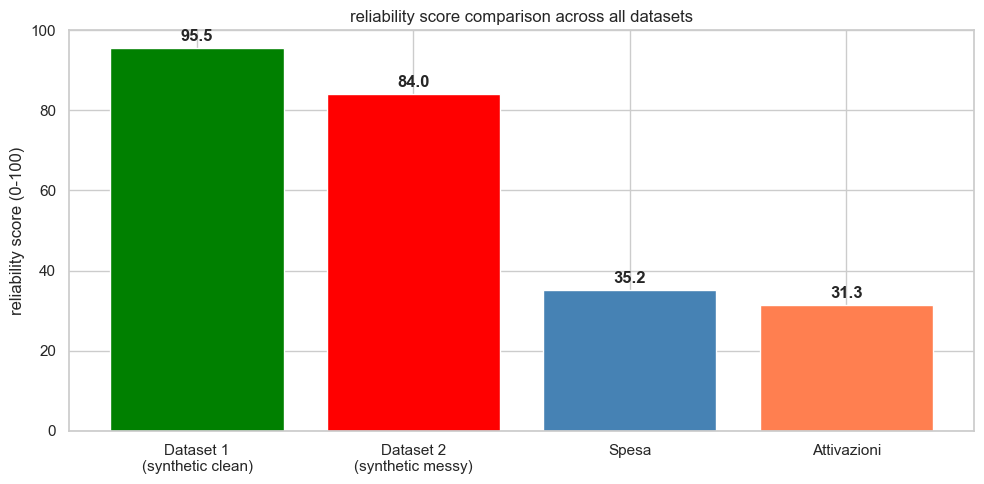

### Environment

To reproduce this project, install the required libraries with:

```bash
pip install -r requirements.txt
```

No GPU or special hardware is required. Tested with Python 3.14.2 on macOS. The optional LLM integration requires either [Ollama](https://ollama.com) running locally with a `llama3` model, or a `GROQ_API_KEY` environment variable set with access to `llama-3.1-8b-instant`.

The real NoiPA datasets (spesa.csv and attivazioniCessazioni.csv) must be placed inside the "datasets/" folder before running the notebook. These files are already included in the GitHub repository, with cloned repository, no action is needed.


## Experimental Design

We ran the pipeline on several datasets to validate the system across different levels of data quality and different real-world structures.

**Experiment 1: Synthetic clean dataset (Dataset 1)**
- Purpose: verify that the pipeline correctly identifies minor issues in a nearly clean dataset and produces a high reliability score
- Baseline: manual inspection of the dataset
- Metrics: reliability score, per-agent scores, number of issues detected, number of suggestions generated

**Experiment 2: Synthetic messy dataset (Dataset 2)**
- Purpose: verify that the pipeline correctly identifies severe quality problems (type mismatches, many missing values, extreme outliers) and produces a significantly lower reliability score than Dataset 1
- Baseline: manual inspection of the dataset
- Metrics: reliability score, per-agent scores, number of issues detected, number of suggestions generated

**Experiment 3: Synthetic large dataset (Dataset 3)**
- Purpose: validate the scalability and robustness of our multi-agent system using a larger, controlled synthethic dataset
- Baseline: manual inspection of the dataset
- Metrics: reliability score, per-agent scores, number of issues detected, number of suggestions generated

**Experiment 4: Real NoiPA dataset - Spesa (Dataset 4)**
- Purpose: test the pipeline on actual NoiPA payroll and tax spending data to verify it scales to real-world inputs and catches genuine data quality issues
- Baseline: synthetic dataset results
- Metrics: reliability score, per-agent scores, number of issues detected, number of suggestions generated, plus number of real duplicate rows and outliers detected

**Experiment 5: Real NoiPA dataset - Attivazioni e Cessazioni (Dataset 5)**
- Purpose: verify the pipeline generalises across datasets with a structurally different set of columns (employee activations and terminations per ministry and region)
- Baseline: Dataset 4 results
- Metrics: reliability score, per-agent scores, number of issues detected, number of suggestions generated, plus number of real duplicate rows and outliers detected


## Results

| Dataset | Schema | Completeness | Consistency | Anomaly | Reliability |
|---------|--------|--------------|-------------|---------|-------------|
| Dataset 1 (synthetic, clean) | 95 | 93.33 | 99.5 | 100 | 96.85 |
| Dataset 2 (synthetic, messy) | 90 | 58.33 | 100 | 100 | 85.50|
| Dataset 3 (synthetic, large) | 90 | 99.39 | 97.5 | 100 | 97.07|
| Dataset 4 (real, Spesa) | 45 | 87.36 | 75 | 40 | 65.71 |
| Dataset 5 (real, Attivazioni) | 25 | 87.56 | 65| 40 | 58.77 |


The results confirm that the system correctly assigns higher reliability scores to cleaner datasets and lower scores to messier ones. On the real NoiPA datasets, the agents detected thousands of genuine issues: 17.162 missing values and 803 numerical outliers in the spesa dataset, and 47.503 missing values and 843 outliers in the attivazioni dataset.

### Missing values per column

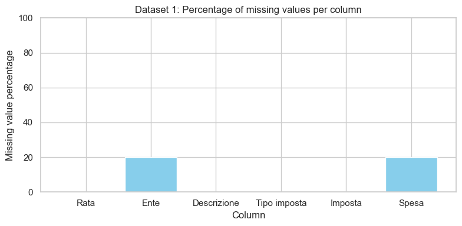
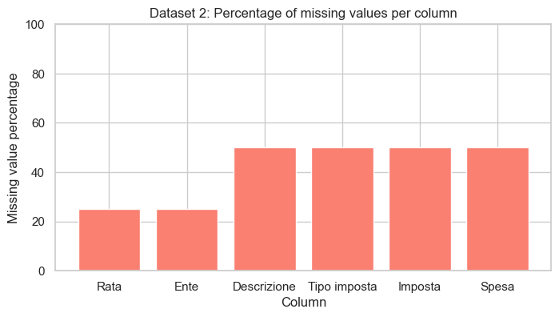
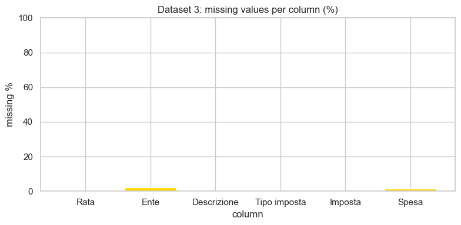
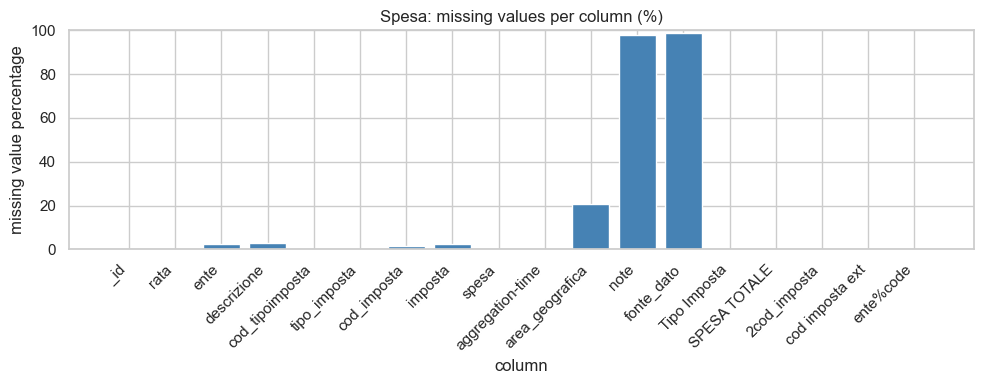
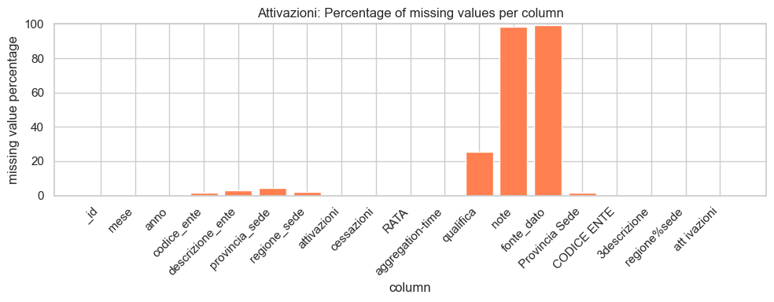

### Reliability score breakdown per agent

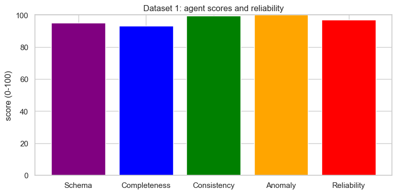
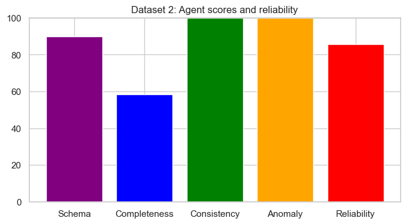
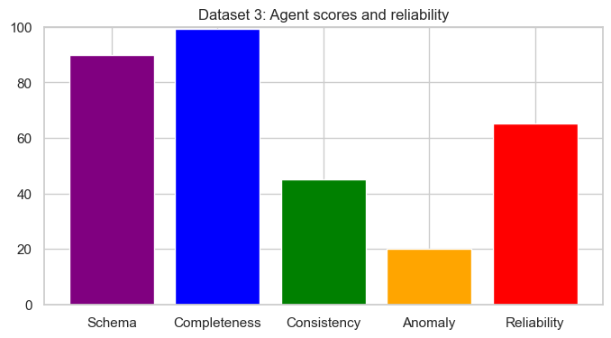
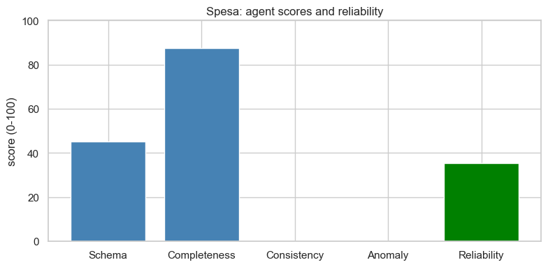
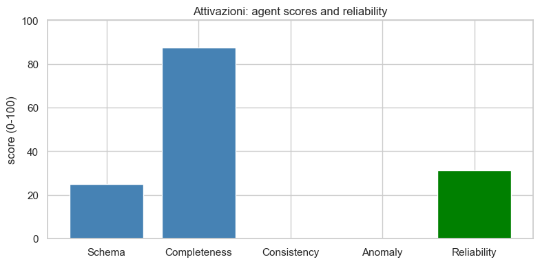

### Overall comparison


## Conclusions 

This project successfully built a modular multi-agent data quality system entirely in Python, without requiring any external services to function. The system automatically detects, reports, and fixes data quality issues across datasets of different sizes and structures. Testing on both synthetic and real NoiPA datasets confirmed that the agents behave correctly: clean datasets receive high reliability scores, while datasets with genuine problems receive appropriately low scores with detailed suggestions for improvement.

The key takeaway is that a multi-agent architecture is well-suited for data quality tasks because each type of check (schema, completeness, consistency, anomaly) is independent and can be developed, tested, and improved in isolation without affecting the others. The modular design also makes it straightforward to add new agents in the future.

Several limitations remain. The statistical checks are relatively simple: Z-scores assume normally distributed data, which may not hold for government spending figures. The cross-column validation rules are currently limited to the Rata column format and could be extended to cover more domain-specific logic. The categorical anomaly detection flags a very large number of rare values in real datasets, which may include false positives. Column names with spaces: the naming-convention check flags any character that is not a letter, digit or underscope. This includes the space in "Tipo imposta", a column name that is standard in the NoiPA payroll schema. The flag is technically correct as spaces in column names can cause issues with SQL exports and some pandas operations, but it is a known false positive in this domain context rather than a data-quality defect in the source data. The mapping heuristic may generate false positives that require manual review - the Rata YYYYMM rule, in contrast, operates without any expected false positives. Future work could include a more sophisticated anomaly detection methods such as Isolation Forest, deeper LLM integration for automatic schema inference, and support for non-CSV formats such as JSON and relational databases.

## Streamlit Demo

To run the interactive app:

1. Clone the repository
2. Install dependencies:
   pip install -r requirements.txt

3. Run the app:
   python -m streamlit run app.py

4. Open the browser at:
   http://localhost:8501

Upload any CSV file to analyze data quality.
